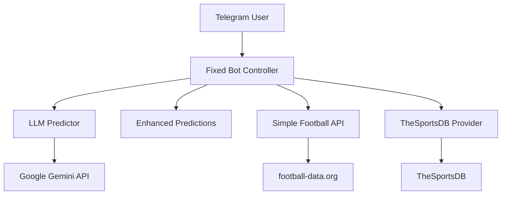
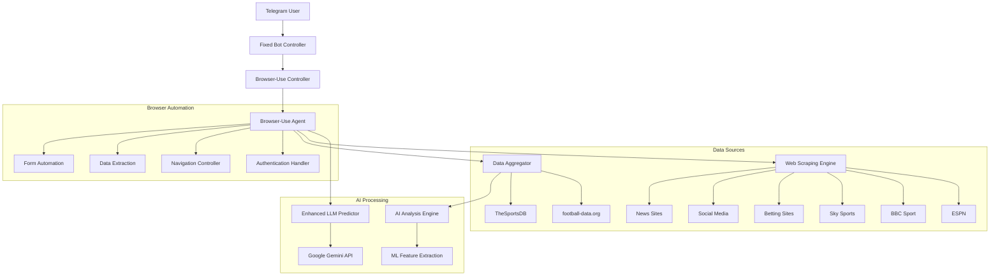
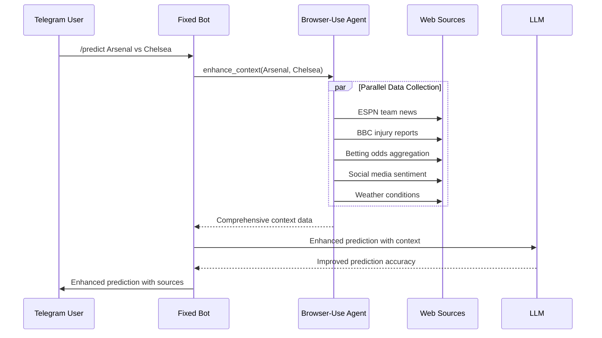
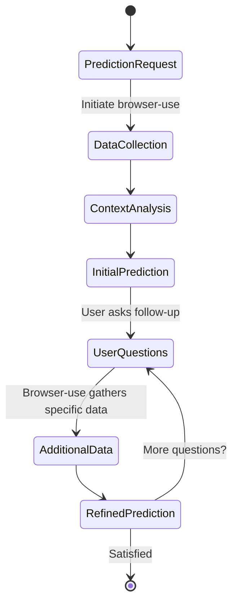
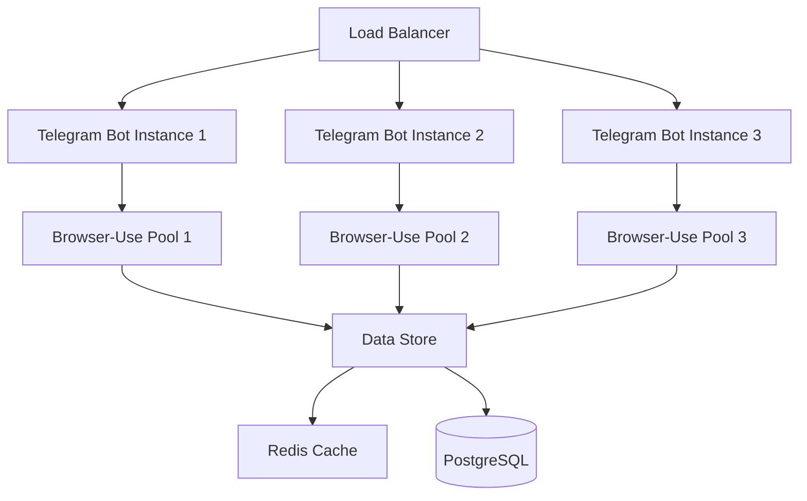

# Browser-Use Integration Analysis for AI Sports Outcome Predictor

## Overview

This document analyzes the integration potential of browser-use, an AI-powered browser automation framework, with the existing AI Sports Outcome Predictor platform. Browser-use is an open-source Python library that enables AI agents to control web browsers, automate complex web tasks, and extract data from any website - capabilities that could dramatically enhance the sports prediction platform's data collection, analysis, and user interaction capabilities.

The current platform operates as a lightweight Telegram bot with limited data sources (football-data.org API and TheSportsDB) and relies primarily on LLM-based predictions through Google Gemini. Integrating browser-use could transform this into a comprehensive sports intelligence platform with real-time data aggregation, enhanced prediction accuracy, and automated workflow capabilities.

## Technology Stack & Dependencies

### Current Platform Stack
- **Backend**: Python 3.11 with Telegram Bot API
- **Prediction Engine**: Google Gemini LLM via google-generativeai
- **Data Sources**: football-data.org API, TheSportsDB API
- **Deployment**: Docker, Render.com, minimal infrastructure

### Browser-Use Integration Requirements
- **Core Library**: browser-use (Python >=3.11)
- **Browser Engine**: Chromium/Chrome via Playwright
- **LLM Support**: Compatible with existing Google Gemini integration
- **Additional Dependencies**: playwright, asyncio support
- **Memory Requirements**: Increased due to browser instances (~200MB per session)

### Dependency Integration Matrix

| Component | Current | With Browser-Use | Impact |
|-----------|---------|------------------|---------|
| Core Runtime | Python 3.11 | Python 3.11 + Playwright | ✅ Compatible |
| Memory Usage | ~50MB | ~250MB | ⚠️ 5x increase |
| LLM Provider | Google Gemini | Google Gemini + Browser Context | ✅ Enhanced |
| Data APIs | 2 sources | Unlimited web sources | 🚀 Exponential |
| Error Handling | Basic | Advanced with visual validation | ✅ Improved |

## Architecture Integration

### Current System Architecture


### Enhanced Architecture with Browser-Use


### Component Integration Strategy

#### 1. Browser-Use Controller Layer
```python
class BrowserUseSportsController:
    def __init__(self):
        # Browser-use agent (navigation only)
        self.agent = Agent(
            task="Sports data collection and analysis",
            llm=ChatOpenAI(model="gpt-4.1-mini"),  # For browser navigation only
            headless=True
        )
        # Gemini 2.5 models for analysis ONLY
        genai.configure(api_key=os.getenv('GEMINI_API_KEY'))
        self.flash_model = genai.GenerativeModel('gemini-2.5-flash')
        self.pro_model = genai.GenerativeModel('gemini-2.5-pro')
        self.data_sources = []
        self.prediction_context = {}
    
    async def enhance_analysis_context(self, home_team: str, away_team: str):
        # Collect real-time data from multiple sources
        raw_data = await self.collect_browser_data(home_team, away_team)
        
        # Process with Gemini 2.5 Flash
        structured_data = await self.flash_model.generate_content_async(
            f"Structure this sports data: {raw_data}"
        )
        
        # Generate analysis with Gemini 2.5 Pro
        analysis = await self.pro_model.generate_content_async(
            f"Analyze {home_team} vs {away_team} using: {structured_data.text}"
        )
        
        return analysis.text
```

#### 2. Enhanced Data Collection Pipeline
- **Real-time News Scraping**: Automate collection from ESPN, BBC Sport, Sky Sports
- **Betting Odds Aggregation**: Extract odds from multiple bookmakers for market consensus
- **Social Media Sentiment**: Analyze Twitter/X discussions and fan sentiment
- **Injury Reports**: Real-time injury and lineup information
- **Weather Data**: Match conditions that could affect gameplay

#### 3. Automated Workflow Integration
- **Scheduled Data Collection**: Run browser agents periodically to update team data
- **Event-Driven Updates**: Trigger data collection on match announcements
- **Contextual Analysis**: Use browser-use to follow links and gather detailed context

## Enhanced Data Collection Capabilities

### Multi-Source Data Aggregation

#### Current Limitations
- Limited to 2 API sources (football-data.org, TheSportsDB)
- Static data updates based on API refresh cycles
- No real-time context or breaking news integration
- Manual configuration for new data sources

#### Browser-Use Enhancements

| Data Category | Current Sources | Browser-Use Sources | Enhancement |
|---------------|----------------|-------------------|-------------|
| Match Fixtures | football-data.org | ESPN, BBC, Sky Sports, Official Sites | Real-time updates |
| Team News | None | Club websites, news aggregators | Breaking news |
| Injury Reports | None | Official team sites, sports media | Live updates |
| Betting Odds | None | Multiple bookmakers | Market consensus |
| Weather | None | Weather services | Match conditions |
| Social Sentiment | None | Twitter/X, Reddit, forums | Fan analysis |

### Real-Time Data Collection Workflows

#### 1. Pre-Match Intelligence Gathering


#### 2. Automated Monitoring Workflows
- **Daily Team Updates**: Scrape official team websites for injury updates
- **Transfer News Monitoring**: Track player movements affecting team strength
- **Form Analysis**: Collect recent match highlights and performance videos
- **Tactical Analysis**: Extract formation and strategy information from sports analysis sites

### Dynamic Data Source Discovery
- **Adaptive Source Detection**: Browser-use can discover new relevant sources automatically
- **Quality Assessment**: Evaluate source reliability and update frequency
- **Redundancy Management**: Cross-validate information across multiple sources

## Advanced Prediction Enhancement

### Context-Aware Prediction Engine

#### Current Prediction Process
1. Basic team names input
2. LLM generates probabilities based on training data
3. Simple heuristic fallback
4. Static confidence scoring

#### Enhanced Prediction with Browser-Use
1. **Multi-dimensional Context Collection**:
   - Recent form from match reports
   - Injury lists from official sources
   - Tactical analysis from expert commentary
   - Historical head-to-head with detailed context

2. **Real-Time Market Intelligence**:
   - Betting market movements
   - Expert tipster consensus
   - Fan sentiment analysis
   - Media prediction aggregation

3. **Dynamic Factor Weighting**:
   - Adjust prediction factors based on current context
   - Real-time team news impact assessment
   - Weather condition adjustments
   - Home advantage modifications

### Enhanced LLM Prompting Strategy

#### Current Prompt Engineering
```python
# Basic prediction prompt
"Matchup: {home_team} vs {away_team}. Return only valid JSON with numeric fields: home_win, draw, away_win (0-100)."
```

#### Gemini 2.5 Enhanced Analysis Strategy
**IMPORTANT**: Only Gemini 2.5 Flash and Gemini 2.5 Pro models will be implemented

```python
# Environment Configuration for Gemini 2.5 Only
GEMINI_API_KEY=your_api_key
GEMINI_FLASH_MODEL=gemini-2.5-flash  # For data processing
GEMINI_PRO_MODEL=gemini-2.5-pro      # For premium analysis

# Dual-model approach:
# 1. Gemini 2.5 Flash: Fast data processing and validation
# 2. Gemini 2.5 Pro: Deep analysis generation

class GeminiAnalysisEngine:
    def __init__(self):
        genai.configure(api_key=os.getenv('GEMINI_API_KEY'))
        self.flash_model = genai.GenerativeModel('gemini-2.5-flash')
        self.pro_model = genai.GenerativeModel('gemini-2.5-pro')
```

#### Browser-Use Enhanced Prompting
```python
# Context-rich prediction prompt
"""
Match Analysis: {home_team} vs {away_team}

CURRENT CONTEXT:
- Recent News: {team_news}
- Injury Reports: {injury_status}
- Betting Market: {odds_analysis}
- Weather: {conditions}
- Fan Sentiment: {social_sentiment}
- Form Analysis: {recent_form}

EXPERT ANALYSIS:
{expert_commentary}

Generate prediction considering all contextual factors...
"""
```

### Machine Learning Feature Engineering

#### Automated Feature Extraction
```python
class BrowserUseFeatureExtractor:
    async def extract_features(self, home_team, away_team):
        features = {}
        
        # Browser-use automated extraction
        features['injury_impact'] = await self.assess_injury_impact(home_team, away_team)
        features['momentum_score'] = await self.calculate_momentum(home_team, away_team)
        features['market_sentiment'] = await self.analyze_betting_patterns(home_team, away_team)
        features['tactical_matchup'] = await self.analyze_tactical_fit(home_team, away_team)
        features['external_factors'] = await self.assess_external_conditions()
        
        return features
```

## Automated User Interaction Features

### Intelligent Command Processing

#### Enhanced Command Capabilities
- **Natural Language Processing**: "Tell me about Arsenal's chances against Chelsea considering their recent injuries"
- **Follow-up Context**: "What about if Salah doesn't play?"
- **Comparative Analysis**: "Compare this to their last meeting"
- **Trend Analysis**: "How has Arsenal performed in similar conditions?"

#### Automated Report Generation
- **Pre-Match Reports**: Comprehensive analysis documents
- **Post-Match Analysis**: Automated result analysis and prediction accuracy
- **Weekly Summaries**: Team performance trends and prediction improvements

### Interactive Prediction Workflows

#### Conversational Analysis


### Proactive User Engagement
- **Breaking News Alerts**: Notify users of significant team news affecting predictions
- **Betting Value Notifications**: Alert when predictions differ significantly from market odds
- **Match Reminders**: Automated reminders with updated predictions closer to kickoff

## `/analysis` Command Implementation Strategy

### Phase 1: Core Analysis Enhancement (Week 1)

#### 1. Browser-Use Integration Setup
```python
# Enhanced analysis_command in fixed_bot.py
class EnhancedSportsBot:
    def __init__(self):
        self.browser_analysis_engine = BrowserAnalysisEngine() if os.getenv('USE_BROWSER_ANALYSIS') == '1' else None
        self.query_validator = SportsQueryValidator()
    
    async def analysis_command(self, update: Update, context: ContextTypes.DEFAULT_TYPE):
        user_id = str(update.effective_user.id)
        
        # Input validation
        if not context.args or len(context.args) < 2:
            await update.message.reply_text(
                "🧠 *Premium Team Analysis*\n\n"
                "Provide two team names for comprehensive analysis.\n"
                "Example: `/analysis Arsenal Chelsea`\n\n"
                "*Enhanced with real-time intelligence* ⚡",
                parse_mode='Markdown'
            )
            return
        
        # Sports query validation
        query = ' '.join(context.args)
        validation = self.query_validator.validate_analysis_query(user_id, query)
        
        if not validation['valid']:
            await update.message.reply_text(f"❌ {validation['reason']}")
            return
        
        home_team, away_team = context.args[0], ' '.join(context.args[1:])
        
        # Premium analysis path
        if self.browser_analysis_engine:
            await self.send_premium_analysis(update, home_team, away_team)
        else:
            await self.send_basic_analysis(update, home_team, away_team)
```

#### 2. Abuse Prevention System
```python
class SportsQueryValidator:
    def __init__(self):
        self.rate_limits = {}  # user_id: {count, reset_time}
        self.sports_keywords = {
            'team_indicators': ['fc', 'united', 'city', 'athletic', 'rovers'],
            'league_terms': ['premier', 'champions', 'europa', 'liga', 'serie'],
            'forbidden': ['hack', 'script', 'bypass', 'exploit', 'download']
        }
    
    def validate_analysis_query(self, user_id: str, query: str) -> dict:
        # Rate limiting (3 analysis per hour per user)
        if not self.check_rate_limit(user_id):
            return {'valid': False, 'reason': 'Rate limit: 3 analyses per hour maximum'}
        
        # Query length validation
        if len(query) > 50:
            return {'valid': False, 'reason': 'Team names too long (max 50 characters)'}
        
        # Sports context validation
        if not self.is_sports_related(query):
            return {'valid': False, 'reason': 'Query must contain valid team names'}
        
        # Forbidden content check
        if any(term in query.lower() for term in self.sports_keywords['forbidden']):
            return {'valid': False, 'reason': 'Invalid query content'}
        
        return {'valid': True, 'reason': 'Valid sports analysis request'}
```

### Phase 2: Premium Data Collection (Week 2)

#### Enhanced Analysis Data Pipeline
```python
class BrowserAnalysisEngine:
    def __init__(self):
        self.agent = Agent(
            task="Sports analysis data collection",
            llm=ChatOpenAI(model="gpt-4.1-mini"),
            headless=True,
            use_vision=False  # Optimize for analysis
        )
    
    async def send_premium_analysis(self, update: Update, home_team: str, away_team: str):
        progress_msg = await update.message.reply_text(
            f"🧠 Analyzing {home_team} vs {away_team}...\n\n"
            "📊 Collecting real-time data\n"
            "⚽ Gathering team intelligence\n"
            "📈 Processing market data"
        )
        
        try:
            # Collect enhanced context
            context_data = await self.collect_analysis_context(home_team, away_team)
            
            # Generate premium analysis
            analysis = await self.generate_premium_analysis(context_data)
            
            # Format and send response
            formatted_response = self.format_premium_analysis(analysis)
            await progress_msg.edit_text(formatted_response, parse_mode='Markdown')
            
        except Exception as e:
            logger.error(f"Premium analysis failed: {e}")
            await progress_msg.edit_text(
                "⚠️ Premium analysis temporarily unavailable.\n"
                "Falling back to standard analysis..."
            )
            await self.send_basic_analysis(update, home_team, away_team)
```

#### Browser-Use Data Collection Tasks
```python
async def collect_analysis_context(self, home_team: str, away_team: str) -> dict:
    collection_tasks = [
        f"Navigate to ESPN and find latest injury news for {home_team}",
        f"Check BBC Sport for {away_team} recent form and team news", 
        f"Collect betting odds consensus for {home_team} vs {away_team}",
        f"Find expert analysis and predictions for this matchup"
    ]
    
    context = {'teams': {'home': home_team, 'away': away_team}}
    
    for task in collection_tasks:
        try:
            result = await self.agent.run(task)
            context[self.extract_data_type(task)] = self.parse_result(result)
        except Exception as e:
            logger.warning(f"Context collection failed for {task}: {e}")
            context[self.extract_data_type(task)] = "Data unavailable"
    
    return context
```

### Resource Management & Security

#### Browser Instance Optimization
```python
class OptimizedBrowserPool:
    def __init__(self, pool_size=1):  # Single instance for analysis
        self.pool_size = pool_size
        self.active_agent = None
        self.session_timeout = 300  # 5 minutes
    
    async def get_analysis_agent(self) -> Agent:
        if not self.active_agent:
            self.active_agent = Agent(
                task="Premium sports analysis",
                llm=ChatOpenAI(model="gpt-4.1-mini"),
                headless=True,
                timeout=30  # Quick timeout for analysis
            )
        return self.active_agent
    
    async def cleanup_after_analysis(self):
        if self.active_agent:
            await self.active_agent.close()
            self.active_agent = None
```

### Analysis Output Enhancement

#### Premium Analysis Response Format
```python
def format_premium_analysis(self, analysis_data: dict) -> str:
    return f"""
🧠 *Premium Team Analysis*

**{analysis_data['home_team']} vs {analysis_data['away_team']}**

📊 **Real-Time Intelligence:**
🏥 Injuries: {analysis_data.get('injury_status', 'No major concerns')}
📰 Latest News: {analysis_data.get('team_news', 'No breaking news')}
📈 Betting Market: {analysis_data.get('market_consensus', 'Even odds')}

⚽ **Form Analysis:**
🏠 {analysis_data['home_team']}: {analysis_data.get('home_form', 'Analyzing...')}
✈️ {analysis_data['away_team']}: {analysis_data.get('away_form', 'Analyzing...')}

🎯 **Expert Assessment:**
{analysis_data.get('expert_analysis', 'Professional analysis complete')}

📊 **Prediction Confidence:** {analysis_data.get('confidence', 'High')}%

*Powered by real-time data intelligence* ⚡
"""
```

## Performance Impact Analysis

### Computational Requirements

#### Current System Resources
- **Memory Usage**: ~50MB base
- **CPU Usage**: Minimal (primarily I/O bound)
- **Network**: Low bandwidth (API calls only)
- **Startup Time**: ~2 seconds

#### Browser-Use Enhanced System
- **Memory Usage**: ~250MB (5x increase due to browser instances)
- **CPU Usage**: Moderate (browser rendering + AI processing)
- **Network**: High bandwidth (multiple web scraping operations)
- **Startup Time**: ~10 seconds (browser initialization)

### Performance Optimization Strategies

#### 1. Resource Management
```python
class OptimizedBrowserPool:
    def __init__(self, pool_size=3):
        self.pool_size = pool_size
        self.available_agents = []
        self.busy_agents = []
    
    async def get_agent(self):
        if self.available_agents:
            agent = self.available_agents.pop()
            self.busy_agents.append(agent)
            return agent
        
        if len(self.busy_agents) < self.pool_size:
            agent = await self.create_new_agent()
            self.busy_agents.append(agent)
            return agent
        
        # Wait for available agent
        return await self.wait_for_available_agent()
```

#### 2. Intelligent Caching
- **Data Source Caching**: Cache frequently accessed data for 5-15 minutes
- **Team Context Caching**: Store team-specific data with smart invalidation
- **Prediction Context Reuse**: Reuse context data for related predictions

#### 3. Asynchronous Processing
- **Parallel Data Collection**: Collect from multiple sources simultaneously
- **Background Updates**: Refresh data in background without user waiting
- **Event-Driven Architecture**: Update only when relevant events occur

### Scalability Considerations

#### Horizontal Scaling Strategy


#### Resource Allocation Matrix

| User Load | Bot Instances | Browser Pool Size | Memory per Instance | Total Memory |
|-----------|---------------|------------------|-------------------|--------------|
| 1-100 users | 1 | 2 | 300MB | 300MB |
| 100-500 users | 2 | 3 | 350MB | 700MB |
| 500-2000 users | 3 | 4 | 400MB | 1.2GB |
| 2000+ users | 4+ | 5+ | 450MB+ | 1.8GB+ |

